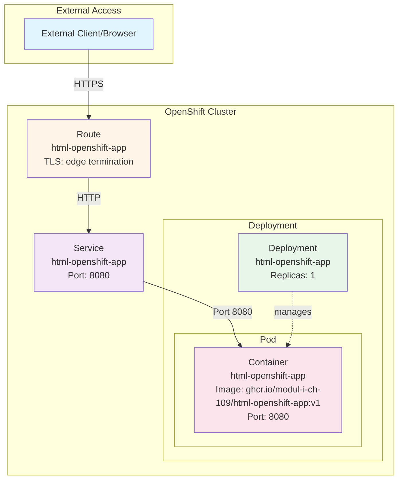

# ZLI-Modul-109-html-openshift-app (Lösung 6.2)

## Technologies

- Docker
- NGINX
- HTML
- OpenShift

---

## How To Use

### Build and push new Image with nginxinc/nginx-unprivileged

```html
FROM nginxinc/nginx-unprivileged
# Copy the entire directory into the default directory of NGINX.
COPY /app /usr/share/nginx/html
```

```html
docker build -f Dockerfile.web -t ghcr.io/<githubusername>/html-openshift-app:latest .
```

```html
docker push ghcr.io/<githubusername>/html-openshift-app:latest
```

### OpenShift

#### 01-with-deployment

1. Sart

```html
oc apply -f oc/01-with-deployment --recursive
```

2. Delete

```html
oc delete all --selector=app=html-openshift-app
```

#### 02-with-template

1. Create OC template

```html
oc apply -f oc/02-with-template --recursive
```

2. Start

```html
oc process html-openshift-app \
  -p NAMESPACE="<Your-Namespace>" \
  -p GIT_SOURCE_URI="<Your-Git-Repo-URL>" \
  -p GIT_USERNAME="<Your-Git-Username>" \
  -p GIT_PAT="<Your-Git-PAT>" | oc apply -f -
```

3. Triggers

```html
oc set triggers deploy/html-openshift-app --from-image=html-openshift-app:latest -c html-openshift-app
```

4. Delete

```html
oc delete all --selector=app=html-openshift-app
```

5. Delete OC template

```html
oc delete template html-openshift-app
```

#### 03-with-buildconfig

1. Andjust Namespace in Image URL of 030-Deployment.yaml

```html
spec:
  template:
    spec:
      containers:
        - name: html-openshift-app
          image: image-registry.openshift-image-registry.svc:5000/<NAMESPACE>/html-openshift-app:latest
```

2. Start

```html
oc apply -f oc/03-with-buildconfig --recursive
```

3. Triggers

```html
oc set triggers deploy/html-openshift-app --from-image=html-openshift-app:latest -c html-openshift-app
```

4. Delete

```html
oc delete all --selector=app=html-openshift-app
```

## Visualization

